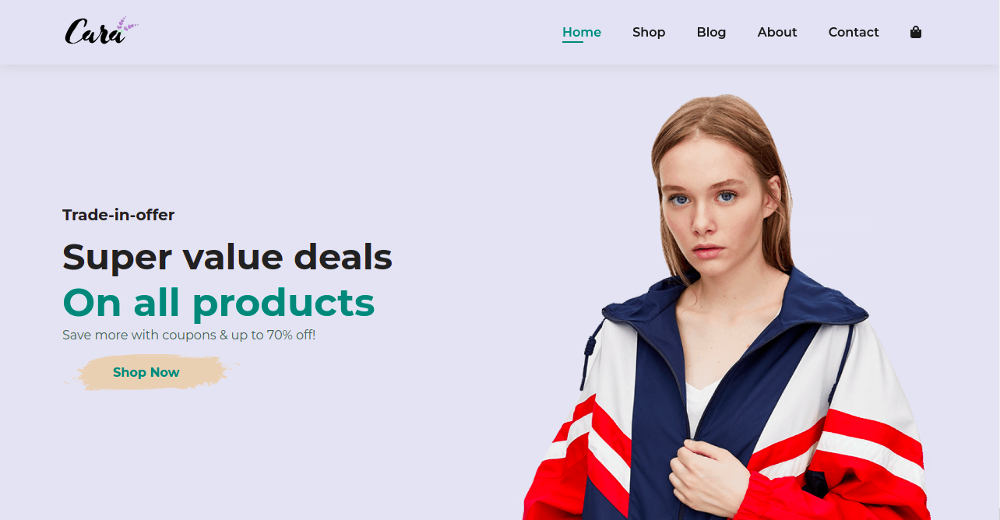
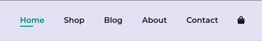
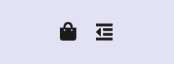
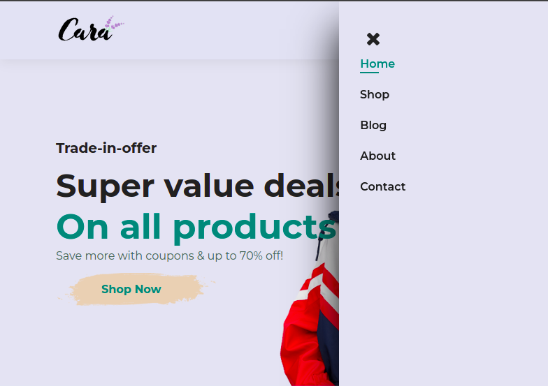
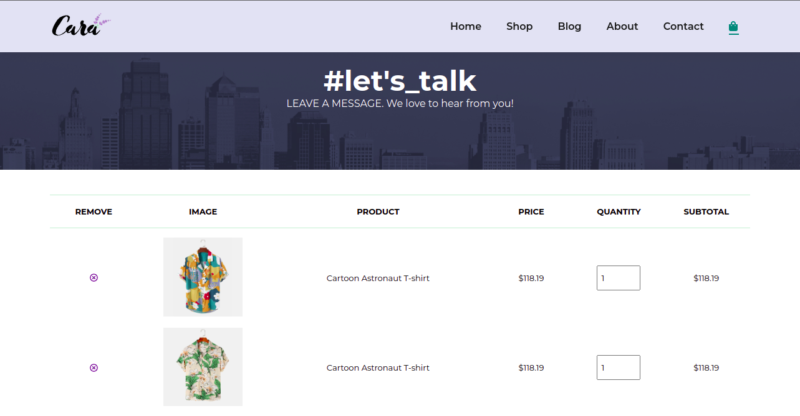
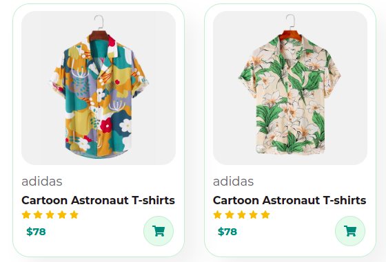

     
    </img>
     
    
ecommerce, Compras realizadas em qualquer aparelho!

     
    
     
     
    </img>
     
     

# Cara:

<!--ts-->

- [Sobre](#sobre)
- [Navegar no website](#navegar)
- [Como usar](#navegar)
   - [Tecnologias](#tecnologias)
<!--te-->

# Navegar no site:

    <h2>Como navegar em nossa aplicação?</h2>
    

    Você pode navegar entre os itens da nossa página clicando nos seguintes links (que se encontra na parte superior do site):
    

    </img>
     
    

    Se estiver utilizando uma tela menor, provavelmente você terá que abrir o menu(també na parte superior), que estará do lado da bolsa:
    

    </img>
     
    
E logo em seguida terá o seguinte resultado(aba lateral com o menu de navegação):

    </img>
     
    
Caso você clique na bolsa, será direcionado para o carrinho de compras.

    </img>
     
    </img>
     
    
Você poderá efetuar futuramente as compras a partir dos seguintes cards: 

    </img>

   
   
   
  =========================================================
  <h2>✅ Javascript Select 🚀 Projeto concluído...  ✅</h2>
  
✅ Todas as aulas completas!

   
   

### Trabalho realizado com

- [x] HTML5
- [x] CSS3
- [x] Javascript
       

## Estudado
- Ecommerce Responsivo usando HTML CSS & JavaScript.
- Completo para iniciantes.
- Página web multi-page responsiva.
- Aprendemos como montar uma página profissional.
- Fundamentos de web design.
- CSS Moderno, flexbox e CSS Grid.
- Como usar componentes e layout patterns para um website profissional.
- Design avançado e responsivo com o uso de media queries.

  
Se você chegou até aqui, muito obrigado por visitar esse perfil! Espero que tenha gostaddo do conteúdo.

  
  

